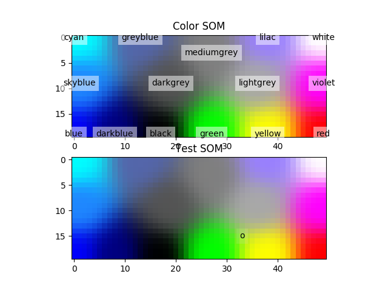
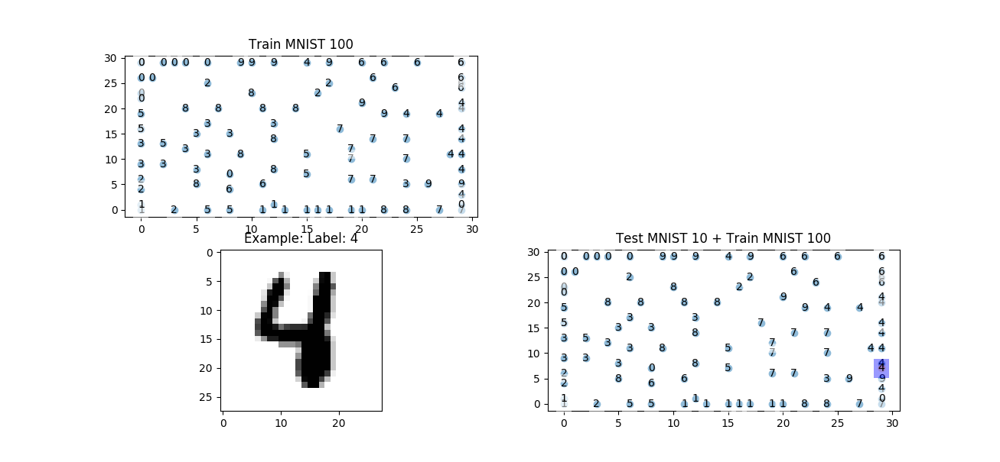

# Soms
Introduced by the Finnish professor Teuvo Kohonen in the 1980s is sometimes called a Kohonen map or network.
To develop this neural network I follow this tutorials:

https://codesachin.wordpress.com/2015/11/28/self-organizing-maps-with-googles-tensorflow/ 

https://wonikjang.github.io/deeplearning_unsupervised_som/2017/06/30/som.html/

http://www.ai-junkie.com/ann/som/som1.html 

In this example I train the model with two dataset: mnist and color. If you installed Tensorflow before, you would run two main in python:

python main.py

  

python mnist_soms.py

  

